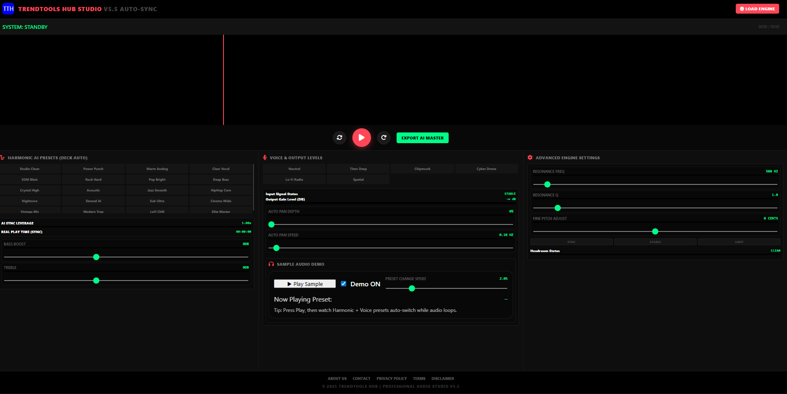

# TrendTools-Hub-Studio
TrendTools Hub Studio – Pro Music Generator
# TrendTools Hub Studio

TrendTools Hub Studio is a creative web-based platform designed to showcase advanced digital tools for content creators, bloggers, and marketers.

This project focuses on providing useful, beginner-friendly tools that help in content creation and trend-based research.

---

## 🔗 Live Project
👉 https://youtu.be/InBBt2F5GyU
👉 https://youtu.be/gwnKefyxjbQ
👉 https://youtu.be/Opoxy6d8dvk
👉 https://youtu.be/UDjNfx7_SHw

---

## 📸 Project Screenshot

## 🎵 Featured Tool: Copyright-Free Pro Music Generator

One of the main tools showcased in this project is a **Copyright-Free Pro Music Generator**, specially designed for creators who need safe background music for:

- YouTube videos
- Blogs
- Reels and Shorts
- Digital content

## 📖 Full Project Explanation (Blog)
The complete explanation and data of this project are available on my blog:
👉 https://trendtoolshub.blogspot.com/2026/01/copyright-free-pro-music-generator-trendtoolshub.html

## 🚀 Key Features
- 100% copyright-free music concept
- Simple and clean interface
- Beginner-friendly project structure
- Web-based (no installation required)

## 🛠️ Technologies Used
- HTML
- CSS
- JavaScript

## 👨‍💻 Who Is This Project For?
- Beginner developers
- Content creators
- Bloggers
- SEO learners

## ✍️ Author
Created by **Falikol**

GitHub Profile:
👉 https://github.com/falikol
